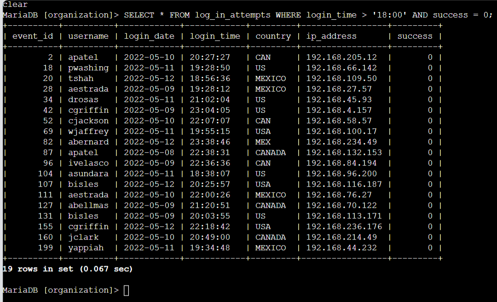
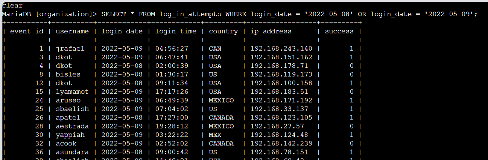
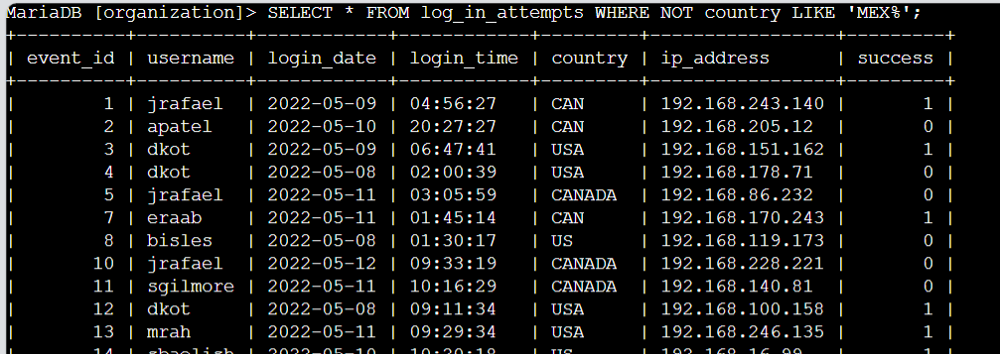
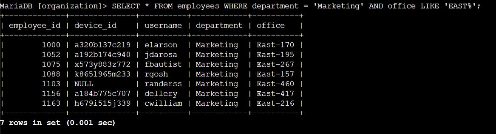
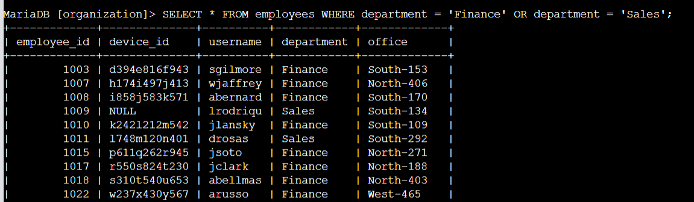
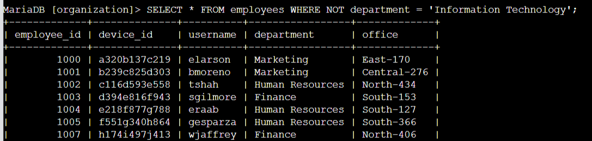

# sql-filtering-lab
Using SQL to query different datasets and records

# Apply filters to SQL queries

## Project description

This basic project description details the scenario of me in the place of a security professional at a large organization. Part of my job is to investigate security issues to help keep the system secure. I have been tasked with examining my organization's employee database, specifically in their 'employees' and 'log_in_attempts tables. Both of which will require me to use SQL filters to retrieve private records and logs from different datasets and investigate potential security issues.

## Project Queries

SELECT, FROM, WHERE, LIKE, AND, OR, NOT

### Retrieve after hours failed login attempts

You recently discovered a potential security incident that occurred after business hours. To investigate this, you need to query the log_in_attempts table and review after hours login activity. Use filters in SQL to create a query that identifies all failed login attempts that occurred after 18:00. (The time of the login attempt is found in the login_time column. The success column contains a value of 0 when a login attempt failed; you can use either a value of 0 or FALSE in your query to identify failed login attempts.)



My inputted query uses the SELECT, FROM, WHERE, & AND SQL commands along with numerical operators to filter out the 'employee' table used in this SQL environments database. Beginning from the SELECT command, the first argument SELECT * indicates that we are requesting ALL columns to be pulled from whichever table we are querying. Which in this scenario is the 'log_in_attempts' table, the FROM 'log_in_attempts' command inputted next is stating once again that we are pulling data ONLY from this said table which details all user/employee information of every log in attempt made based off of the following argument we will input next. The WHERE command indicates the requirements needed to be met to display information from the 'log_in_attempts' table. In this case we were asked to only display login attempts which took place after normal office hours which was '18:00' and those of which attempts also needed to be failed login attempts which is represented by 'success = 0' where 0 is the boolean value that indicates false. Both requirements are needed to be met simultaneously in order for the information to be displayed, that is where we bring in the AND command which we use to combine both arguments into our query.

The final completed line looks like this:

```sql
SELECT * FROM log_in_attempts WHERE login_time > '18:00' AND success = 0;
```

### Retrieve login attempts on specific dates

A suspicious event occurred on 2022-05-09. To investigate this event, you want to review all login attempts which occurred on this day and the day before. Use filters in SQL to create a query that identifies all login attempts that occurred on 2022-05-09 or 2022-05-08.



This is another query a little different from the previous one. Now instead of both WHERE arguments needing to be met simultaneously, I will need to use the OR statement in order to display the results on both arguments. I still will pull all the same data from the table and columns but now this time I am filtering out only the log in attempts that have occurred on either of two dates '2022-05-08' or '2022-05-09'. So I will begin with the same starting prompt, SELECT * FROM log_in_attempts WHERE...... then once I reach my first argument after the WHERE statement this time I need to pull out dates, so I use 'login_date' as my first clause and have the operator set it equal to 'X' which is the first date, then I separate it with an OR which indicates both either the first OR the second argument can be true to display the data requested. The next argument is the same line but with the secondary date 'login_date' operator set equal to 'Y' which looks something like this; WHERE login_date = '2022-05-08' OR login_date = '2022-05-09'

The final line will look like this after completion:

```sql
SELECT * FROM log_in_attempts WHERE login_date = '2022-05-08' OR login_date = '2022-05-09';
```

### Retrieve login attempts outside of Mexico

There's been suspicious activity with login attempts, but the team has determined that this activity didn't originate in Mexico. Now, you need to investigate login attempts that occurred outside of Mexico. Use filters in SQL to create a query that identifies all login attempts that occurred outside of Mexico. (When referring to Mexico, the country column contains values of both MEX and MEXICO, and you need to use the LIKE keyword with % to make sure your query reflects this.)



This query will use a different command statement than the other two because rather than requesting that information display matches the stated requirement, I am request that it does NOT match the argument stated. Which brings me to introduce the NOT command statement which is used to negate a condition inputted into the CLI instead of meeting it. Once again I start off the query with pulling all column information from the 'log_in_attempts table' like so; SELECT * FROM log_in_attempts WHERE...... now for my where condition I am asking my system to display all login attempts which did NOT occur in the country Mexico. In this scenario there are values in the table which contain both 'MEX' and 'MEXICO' so I will need to be more vague. So in this statement I will need to use the wildcard operator '%' to request NOT to pull out any similar data. When it comes to SPECIFIC numerical or string data I will use an operator to set the requested data equal to, not equal to, greater than, etc.... Although with numerical or string data that is NON-SPECIFIC I will need to use the LIKE command statement to tell my system to query the rest of it. So after my WHERE statement I begin with NOT country LIKE 'MEX%'; and close the statement.

The final inputted line should look like this:

```sql
SELECT * FROM log_in_attempts WHERE NOT country LIKE 'MEX%';
```

### Retrieve employees in Marketing

Your team wants to perform security updates on specific employee machines in the Marketing department. You're responsible for getting information on these employee machines and will need to query the employees table. Use filters in SQL to create a query that identifies all employees in the Marketing department for all offices in the East building. (The department of the employee is found in the department column, which contains values that include Marketing. The office is found in the office column. Some examples of values in this column are East-170, East-320, and North-434. You'll need to use the LIKE keyword with % to filter for the East building.)



This scenario still asks for all column data in our table so I will begin with the SELECT * command statement, this time around I will need to pull data from a different table so after my FROM statement I will input employees, to indicate I need to pull information from the 'employees' table. After my WHERE statement is where I begin with my conditions. The scenario asks to pull all data from both the 'department' and 'office' columns to display all Marketing employee information located in only the East offices. So that means our statement should require that both conditions be met. With this in mind I will need to use the AND statement to separate both conditions. Since the department requested has been specifically stated I will use the '=' operator to set it equal to 'Marketing'. Now I need to make sure the second condition querying office information is met simultaneously with the first so I will use the AND command and LIKE statement afterwards because the second condition is non-specific and contains a wildcard; office LIKE 'EAST%'; and then finally I will close the statement.

The final line will look like this:

```sql
SELECT * FROM employees WHERE department = 'Marketing' AND office LIKE 'EAST%';
```

### Retrieve employees in Finance or Sales

Your team now needs to perform a different security update on machines for employees in the Sales and Finance departments. Use filters in SQL to create a query that identifies all employees in the Sales or Finance departments. (The department of the employee is found in the department column, which contains values that include Sales and Finance.)



This query was a very standard one, all that is asked is that I pull ALL column information from the employees table that only contains data from either the Finance OR the Sales department.

So because we want all column information I begin with SELECT * and then we are pulling the data FROM the 'employee' table. WHERE we only want our data to associate with employees either in the Finance OR the Sales department.

The final line should look like this:

```sql
SELECT * FROM employees WHERE department = 'Finance' OR department = 'Sales';
```

### Retrieve all employees not in IT

Your team needs to make one more update to employee machines. The employees who are in the Information Technology department already had this update, but employees in all other departments need it. Use filters in SQL to create a query which identifies all employees not in the IT department. (The department of the employee is found in the department column, which contains values that include Information Technology.)



In this standard scenario I am being asked to pull all column information from the employees table which contains all data information which does NOT have its department listed under Information Technology. I input SELECT * for all column information, then FROM employees to indicate I am pulling information from this table. Lastly after the WHERE statement to include my condition I input the NOT command to signify I only want department data not listed under 'Information Technology' and I use the '=' operator because the condition contains specific string data.

The final statement should look something like this:

```sql
SELECT * FROM employees WHERE NOT department = 'Information Technology';
```

## Summary

In this project, I practiced using SQL to filter and retrieve specific records from both login activity logs and employee data in order to support a security investigation and routine department updates. This kind of targeted querying is a core skill for a SOC analyst, where the ability to quickly isolate relevant login attempts, flag suspicious patterns, and pull precise employee or system records can directly impact how fast a threat is identified and contained. Being comfortable writing efficient, accurate SQL filters means less time sifting through irrelevant data and more time focused on actual analysis and response. This project reflects the kind of hands-on database querying I'd bring to a security operations role, where speed and precision in data retrieval are essential to keeping an organization's systems secure.

## Repository Structure

```
├── README.md
└── sql-lab-images/
    ├── 01_after_hours_failed_logins.png
    ├── 02_specific_date_logins.png
    ├── 03_outside_mexico_logins.png
    ├── 04_marketing_east_office.png
    ├── 05_finance_or_sales.png
    └── 06_not_it_department.png
```
